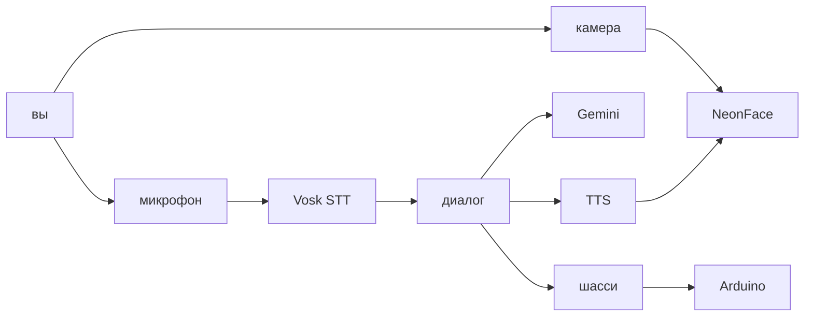
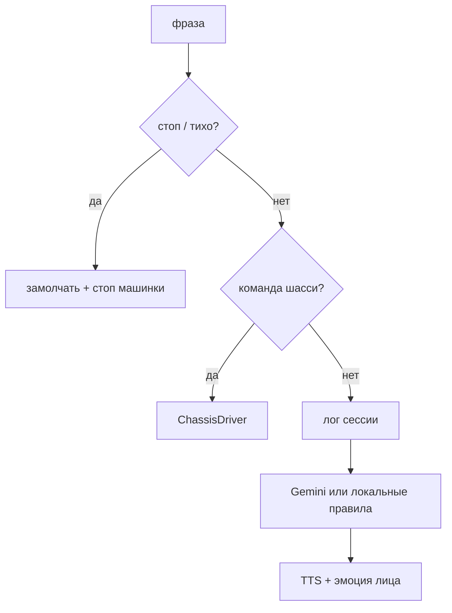
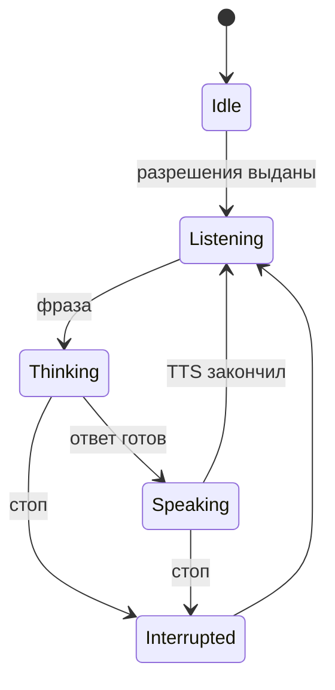

# Jasper — продуктовая спецификация

**Ветка:** `main` (текущая разработка — `jasper10`)  
**Версия:** 2.0  
**Платформа:** Android 8+ (API 26), landscape  
**Обновлено:** после игр, сессии диалога и Bluetooth-шасси

---

## Что это

**Jasper** — Android-приложение с живым неоновым «лицом» на чёрном экране. Персонаж смотрит на пользователя через фронтальную камеру, ведёт голосовой диалог на русском, играет в слова и загадки и ездит на Arduino-машинке по голосовым командам.

Это интерактивный цифровой компаньон: минималистичный интерфейс (только лицо), выразительная анимация, разговор и тело на колёсах.

## Персонаж

| Аспект | Описание |
|--------|----------|
| Образ | Неоновое лицо: крупные блочные глаза, брови, рот на чёрном фоне |
| Характер | Любопытный ребёнок 5–7 лет — любит исследовать, игры и «научные» вопросы; радуется похвале |
| Язык | Русский (речь и ответы) |
| Стиль речи | Короткие фразы (до ~12 слов) в обычном чате; в играх чуть длиннее — загадка или данетка |
| Игры | Только четыре: Слова, Угадай слово, Загадки, Данетки |

## Для кого

- Домашние эксперименты с эмоциональным UI, камерой, голосом и робо-шасси
- Демо и прототипирование «живого» персонажа на экране
- Интерактивный экран-компаньон для детей и взрослых

## Ценность

| Возможность | Зачем пользователю |
|-------------|-------------------|
| Голосовой диалог | Можно говорить с Jasper — он понимает и отвечает |
| Эмоции и анимация | Персонаж «живой»: моргает, дышит, реагирует на фразы и улыбку |
| Взгляд следует за головой | Ощущение зрительного контакта |
| Голосовые игры | Можно сыграть в слова, загадки и данетки без отдельных экранов |
| Память сессии | Jasper не здоровается заново и не предлагает ту же игру повторно |
| Машинка | Голосом: «вперёд», «налево», «погуляй», «за мной» |
| Неоновый стиль | Запоминающийся, минималистичный образ |
| Реакция на улыбку | Jasper замечает улыбку и радуется вместе |

## Текущее поведение

### Визуал

1. **Лицо** — блочные глаза (синяя заливка, светлая рамка), брови, рот (pink/yellow) на чёрном фоне
2. **9 эмоций** — neutral, happy, playful, sad, offended, surprised, angry, afraid, sleepy
3. **Взгляд** — зрачки-блоки следуют за поворотом головы пользователя (yaw/pitch)
4. **Idle-анимации** — случайное моргание, микро-saccades, «дыхание» (пульс масштаба)
5. **Фазы диалога** — визуальные подсказки: слушаю (брови ↑), думаю (взгляд ↑), говорю (lip sync)
6. **Lip sync** — рот двигается в такт речи Jasper

Подробности: `.memory-bank/features/visual.md`.

### Голос и диалог

1. **Распознавание речи** — непрерывный офлайн STT на русском (Vosk)
2. **Ответы через LLM** — Gemini генерирует короткий ответ + эмоцию + тон голоса
3. **Лог сессии** — до 50 реплик пользователя и Jasper уходят в следующий промпт
4. **Локальный fallback** — без API-ключа работают шаблонные реакции на ключевые слова (привет, злюсь, боюсь, спать…)
5. **TTS** — Android Text-to-Speech с разным pitch/rate под эмоцию
6. **Стоп-команды** — «стоп», «тихо», «подожди», «замолчи» и др. мгновенно прерывают речь
7. **Реакция на улыбку** — при устойчивой улыбке пользователя Jasper говорит короткую радостную фразу

Подробности: `.memory-bank/features/voice.md`.

### Голосовые игры

Четыре игры заданы в промпте; отдельного экрана нет — Jasper ведёт партию голосом.

| Игра | Правила |
|------|---------|
| **Слова** | Следующее слово начинается с последней буквы предыдущего |
| **Угадай слово** | Уточняющие вопросы, до 20 попыток, иначе «сдаюсь» |
| **Загадки** | Детские загадки по очереди, до 5 попыток |
| **Данетки** | Вопросы только «да» / «нет», до 20 попыток |

### Машинка

Голосовые команды по Bluetooth Classic (HC-06). Руление берётся с **partial** STT — не нужно ждать конца фразы.

| Команда | Действие |
|---------|----------|
| «Джаспер, вперёд / назад / налево / направо» | Едет в эту сторону |
| «боком налево / направо» | Сдвиг боком |
| «погуляй» | Объезд препятствий (мозг машинки) |
| «за мной» | Следование за объектом |
| «стоп» | Стоп |
| «подключись» / «блютуз» | Переподключить Bluetooth |

Пока телефон на связи, Arduino в режиме **PHONE**: ультразвук не перебивает «вперёд». Без телефона — **LEGACY**. Подробности: `.memory-bank/features/chassis.md`.

### Диалоговая модель

| Фаза | Что происходит |
|------|----------------|
| IDLE | Нет разрешений или ожидание |
| LISTENING | Микрофон активен, Jasper слушает |
| THINKING | Фраза отправлена в LLM |
| SPEAKING | Jasper говорит, микрофон на паузе |
| INTERRUPTED | Пользователь прервал (стоп-команда) |

## Что намеренно отключено / отложено

| Функция | Причина |
|---------|---------|
| Текстовый overlay распознанной речи | Убран — экран только с лицом |
| Barge-in (перебивание голосом во время TTS) | Эхо TTS попадает в микрофон и вызывает самопрерывание |
| Зеркалирование эмоций с камеры | Эмоции задаёт LLM, не ML Kit |
| Реакция на язык | Пробовали — не работало стабильно |
| Другие игры кроме четырёх | Промпт явно запрещает выдумывать новые |

## Направление развития

См. `.memory-bank/roadmap.md`. Ближайшие приоритеты:

- Barge-in с AEC или tap-to-interrupt
- Более «мультяшный» голос (Piper / cloud TTS)
- Распознавание человека и персональная память между сессиями
- Автономное idle-поведение, когда никто не говорит

## Ограничения

- Камера, микрофон; интернет только для Gemini (STT офлайн)
- Bluetooth опционален — без машинки Jasper остаётся лицом на экране
- Горизонтальная ориентация экрана
- Android 8+ (API 26), Java 17 для сборки
- Во время ответа Jasper перебить голосом нельзя — только стоп-командой
- Качество распознавания зависит от микрофона и фонового шума

## Конфигурация

- **Gemini API key** (опционально) — в `local.properties` → `gemini.api.key`
- Без ключа Jasper отвечает только на ключевые слова из локального словаря и исполняет regex-команды машинки
