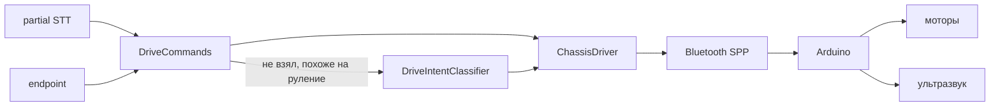
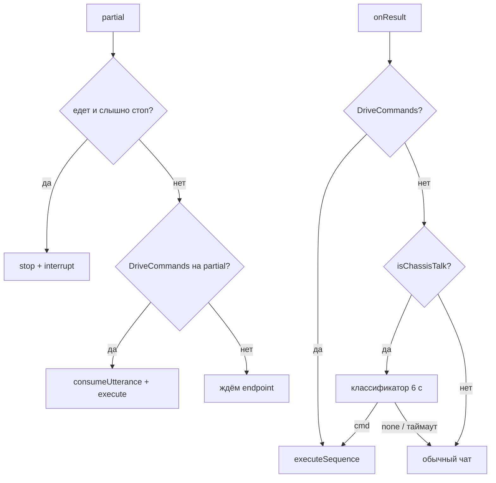
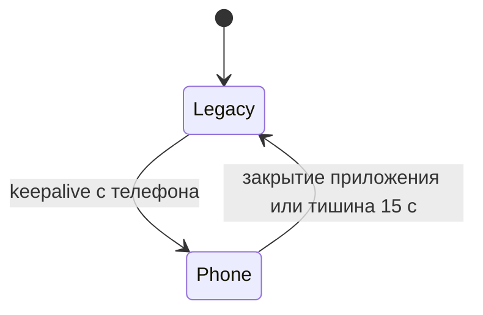

# Шасси

## Обзор

Телефон с Jasper ставится на Arduino-машинку. Голос → regex или Gemini-классификатор → Bluetooth Classic SPP → прошивка `jasper_chassis.ino`.

Без Bluetooth Jasper остаётся лицом на экране: шасси опционально.

---

## Компоненты Android

### DriveAction

`chassis/DriveCommands.kt`

| Действие | Код | Удержание | Голосовой ack |
|----------|-----|-----------|---------------|
| FORWARD | `A` | 2500 мс | «Поехали!» |
| BACKWARD | `B` | 2500 мс | «Назад!» |
| STRAFE_LEFT / RIGHT | `C` / `D` | 2500 мс | «Боком!» |
| ROTATE_LEFT / RIGHT | `E` / `F` | 600 мс | «Налево!» / «Направо!» |
| FOLLOW | `W` | нет | «Бегу за тобой!» |
| WANDER | `T` | нет | «Погуляю!» |
| STOP | `S` | нет | — |
| CONNECT | reconnect | нет | «Подключился!» / «Машинка не слышит!» |

Поворот короче, чтобы не крутиться на 360°.

### DriveCommands

Regex по фразе и alternatives. Учитывает кривое STT имени («расперь», «гаспер») и односложные alts («вперёд», «налево»).

Примеры: «Джаспер, вперёд», «налево боком», «погуляй», «за мной», «подключись», «блютуз».

`parseSequenceAny` — несколько команд из одной реплики (очередь до 4).

`isChassisTalk` — фраза похожа на руление, но regex не сработал → включить Gemini-классификатор.

### DriveIntentClassifier

`chassis/DriveIntentClassifier.kt`

Ловит кривой STT («джазпер на лево»), который regex не берёт.

- Только если `classifyDrive=true` (экран решил, что это похоже на руление)
- Gemini, `temperature=0.1`, первая модель, таймаут 5 с (мозг ждёт 6 с)
- JSON: `{"cmd":"forward|back|left|right|strafe_left|strafe_right|follow|wander|stop|connect|none"}`
- Приветствия и болтовня → `none`, идём в чат

### ChassisDriver

`chassis/ChassisDriver.kt`

- Bluetooth Classic SPP UUID `00001101-0000-1000-8000-00805F9B34FB`, fallback канал 1
- Ищет сопряжённое устройство по имени: HC-06, HC-05, HC-08, linvor, BT04, MLN
- После коннекта шлёт `%P#` и keepalive каждые 4 с
- Импульсные A–F повторяются каждые 200 мс, пока не истечёт `holdMs`, затем `%S#`
- `executeSequence` — очередь команд с паузой 250 мс
- При `release()`: `%S#%O#` — стоп и вернуть LEGACY

---

## Когда команда берётся

Имя без команды («Джаспер») не уходит в Gemini.

---

## Прошивка Arduino

Скетч: `arduino/jasper_chassis/jasper_chassis.ino`  
Документ прошивки: `arduino/README.md`

Протокол: ASCII `%` + буква + `#`. Bluetooth: SoftwareSerial `A0` RX / `A1` TX, 9600. Ультразвук: trig `A3`, echo `A2`.

### Режимы PHONE / LEGACY

| Режим | Поведение |
|-------|-----------|
| **LEGACY** | Старый код машинки: импульсы, ультразвук сам объезжает на T/W, нет команды → стоп |
| **PHONE** | Моторы держат последнюю команду; ультразвук **не** спорит с «вперёд». T/W по-прежнему отдают руль датчику |

В PHONE команды A–L не импульсные с точки зрения Arduino: едет, пока телефон повторяет байт или не придёт `%S#`. Если повторы пропали на 0.8 с — стоп (телефон завис).

| Код | Действие |
|-----|----------|
| `%P#` | Режим телефона (keepalive) |
| `%O#` | Вернуть старую прошивку |
| `%A#` … `%F#` | Вперёд, назад, боком, повороты |
| `%G#` … `%L#` | Диагонали и дрифт (прошивка; Android пока не шлёт) |
| `%T#` | Объезд препятствий |
| `%W#` | Следование за объектом |
| `%S#` | Стоп |

---

## Разрешения

- `BLUETOOTH` / `BLUETOOTH_ADMIN` до API 30
- `BLUETOOTH_CONNECT` с API 31
- Feature `android.hardware.bluetooth` — `required=false`

---

## Ограничения

- Нужно заранее сопрячь HC-06 в настройках Android
- Без ключа Gemini классификатор молчит — работают только regex
- Partial может сработать раньше, чем договорит пользователь всю фразу
- Barge-in голосом во время TTS по-прежнему нет; «стоп» во время езды слушается с partial
