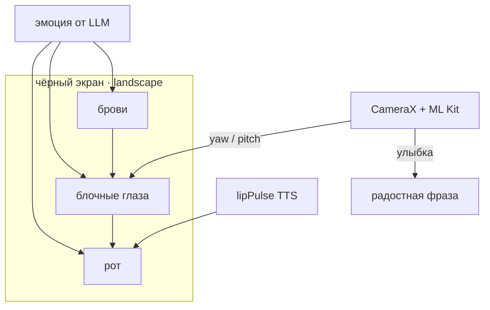
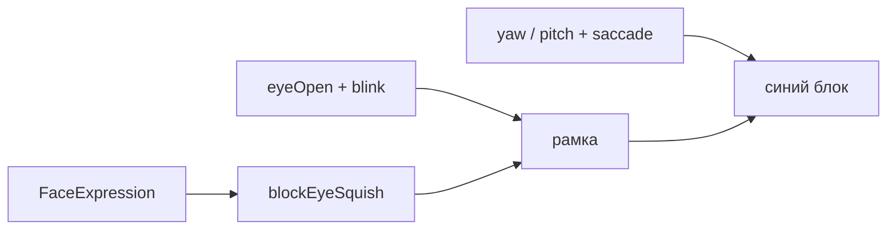
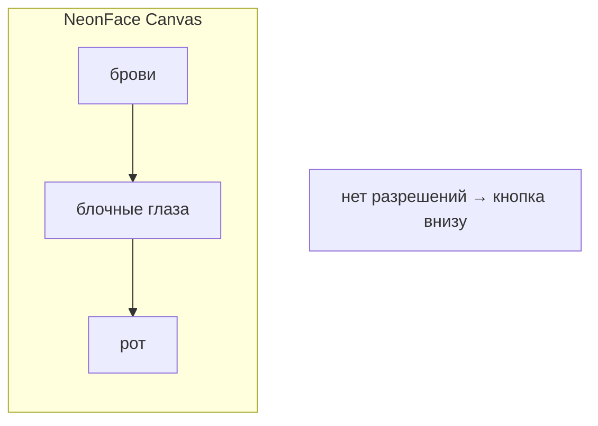
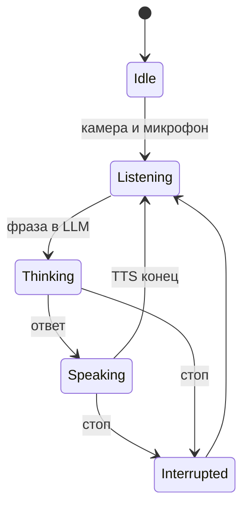

# Визуальная реализация

## Обзор

Визуальный модуль — неоновое «лицо» на чёрном фоне: крупные **блочные** глаза, брови, рот. Без контура лица, щёк, носа. Отрисовка на Jetpack Compose `Canvas`.

Эмоции задаёт **LLM** (`FaceExpression`), а не зеркалирование с камеры. Камера используется для взгляда, моргания пользователя и детекции улыбки (реакция Jasper).



---

## Стиль

| Элемент | Цвет | HEX |
|---------|------|-----|
| Фон | Чёрный | `#000000` |
| Рамка глаза | Светлая | `#E3F2FD` |
| Блок-зрачок | Синий | `#1565FF` |
| Блик зрачка | Голубой | `#64B5FF` |
| Циан (брови / неон) | Cyan | `#00F0FF` |
| Рот (обычный) | Pink неон | `#FF2DAA` |
| Рот (радость) | Yellow неон | `#FFEA00` |
| Акценты | Purple / Orange | `#B388FF` / `#FF5722` |

Эффект неона — несколько слоёв stroke с разной прозрачностью + тонкая «горячая» линия. Глаза специально крупные и прямоугольные, чтобы читались с расстояния.

---

## Ориентация

- Экран в **landscape** (`AndroidManifest.xml`)
- Масштаб от высоты экрана
- Камера невидима (только `ImageAnalysis` 320×240, без preview)

---

## Компоненты

### NeonFace

`ui/NeonFace.kt` — главный composable.

**Входные параметры:**

```kotlin
faceState: FaceState       // с камеры: взгляд, моргание, улыбка
expression: FaceExpression // эмоция от LLM / реакций
dialogPhase: DialogPhase   // фаза диалога
isSpeaking: Boolean        // Jasper говорит
lipPulse: Float            // от TTS onRangeStart
```

**Анимации:**

| Эффект | Механизм |
|--------|----------|
| Смена эмоции | `animateFloatAsState` (spring) — рот, брови, глаза |
| Idle-моргание | `LaunchedEffect`, random 3–7 с, двойное моргание |
| Saccades | spring + idle drift по синусоиде |
| Дыхание | `infiniteTransition`, scale 0.99 ↔ 1.02 |
| Squash & stretch | при смене `expression` — squashX/Y через state |
| Bounce | краткий scale-up при смене эмоции |
| Пульс неона | `glowPulse`, скорость зависит от эмоции |
| Lip sync | `mouthDrive` + `lipPulse` при `isSpeaking` |
| Фазы диалога | смещение бровей и взгляда по `DialogPhase` |

**Важно:** `Animatable.value` внутри `Canvas` не триггерит recomposition — использовать `mutableFloatStateOf` + `animateFloatAsState`.

### FaceExpression

`model/FaceExpression.kt` — 9 эмоций:

`NEUTRAL`, `HAPPY`, `PLAYFUL`, `SAD`, `OFFENDED`, `SURPRISED`, `ANGRY`, `AFRAID`, `SLEEPY`

Каждая задаёт:

- `smileAmount` — форма рта (> 0 улыбка, < 0 грусть)
- `eyeOpen` — открытость глаз (SLEEPY → 0.32, AFRAID → 1.08)
- `browInnerLift`, `browOuterLift` — положение бровей
- Базовый подъём бровей: `BROW_BASE_RAISE = -6f`

### Глаза

Форма — не овал, а **блок**: `drawBlockEye`.

- Рамка: прямоугольник со светлым stroke
- Зрачок: синий прямоугольник внутри, ездит по yaw/pitch
- Эмоция сужает рамку асимметрично (`blockEyeSquish`): злость — внутренний край, грусть — внешний
- При почти закрытом глазе (`squish < 0.18`) рисуется узкая щель
- Моргание пользователя: `faceState.leftEyeOpen` / `rightEyeOpen` с камеры
- Idle-моргание Jasper: независимо, кроме `SLEEPY`
- При `DialogPhase.THINKING` — взгляд чуть вверх
- При `DialogPhase.LISTENING` — брови приподняты



### Брови

- Дуги с `browInnerLift` / `browOuterLift` от `FaceExpression`
- Дополнительное смещение от `DialogPhase`
- Разные формы для angry (сведены), afraid (подняты), sleepy (опущены)

### Рот

- Форма от `expression.smileAmount` — quadratic bezier
- При `isSpeaking` — открытый рот (lip sync):
  - `lipPulse` от TTS `onRangeStart`
  - fallback-осцилляция `mouthDrive`
  - `speakOpen = max(mouthDrive, lipPulse)`

### FaceAnalyzer + FaceState

`camera/FaceAnalyzer.kt` → `model/FaceState.kt`

ML Kit Face Detection (FAST, CLASSIFICATION_MODE_ALL):

- `leftEyeOpenProbability`, `rightEyeOpenProbability` → моргание
- `smilingProbability` → улыбка (для реакции Jasper, не для рта)
- `headEulerAngleX/Y/Z` → pitch, yaw, roll
- Yaw инвертирован для фронтальной камеры

Пороги моргания:

- `< 0.25` — глаз закрыт
- `0.25..0.45` — плавный переход
- `> 0.45` — открыт

### FaceMirrorScreen

`ui/FaceMirrorScreen.kt`

- Оркестрация: камера + речь + диалог + эмоции + шасси
- `maybeReactToSmile()` — улыбка >= 0.52, 6 кадров, cooldown 10 с
- `handleUserPhrase()` — STT → шасси / стоп / LLM
- `respondWithVoice()` — TTS + смена `faceExpression`
- `resetExpressionLater()` — возврат к NEUTRAL через 5 с

---

## Слои на экране



Текстовый overlay убран. При отсутствии разрешений — кнопка «Разрешить доступ» внизу.

---

## DialogPhase → визуал

| Фаза | Визуальный эффект |
|------|-------------------|
| IDLE | Нейтральное лицо |
| LISTENING | Брови чуть приподняты |
| THINKING | Взгляд вверх, брови приподняты |
| SPEAKING | Lip sync, эмоция от LLM |
| INTERRUPTED | Краткий сброс, затем LISTENING |



---

## Реакция на улыбку

Камера детектирует улыбку пользователя → Jasper отвечает голосом (HAPPY/PLAYFUL), без LLM.

Пороги в `FaceMirrorScreen`:

- `SMILE_THRESHOLD = 0.52`
- `SMILE_HOLD_FRAMES = 6`
- `SMILE_REACTION_COOLDOWN_MS = 10000`

Не срабатывает во время THINKING / SPEAKING.

---

## Возможные улучшения

- Независимое движение левой/правой брови
- Landmarks ML Kit для точнее губ
- Реакция на `roll` (наклон головы)
- Rive / Lottie при усложнении анимаций
- Particle-эффекты при сильных эмоциях
- Настройка цветов / темы
