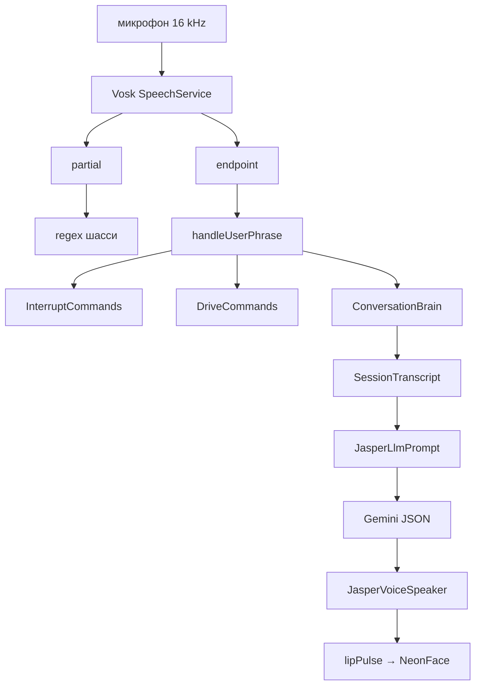
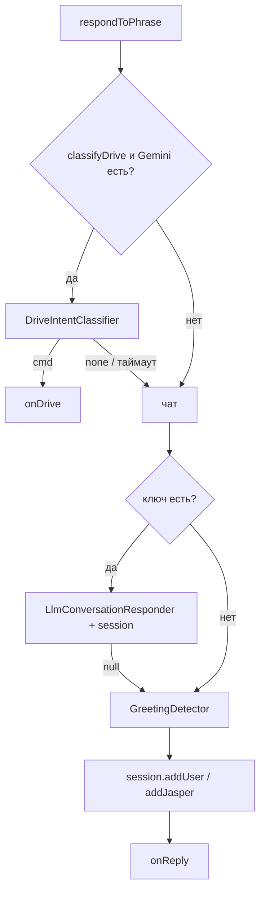
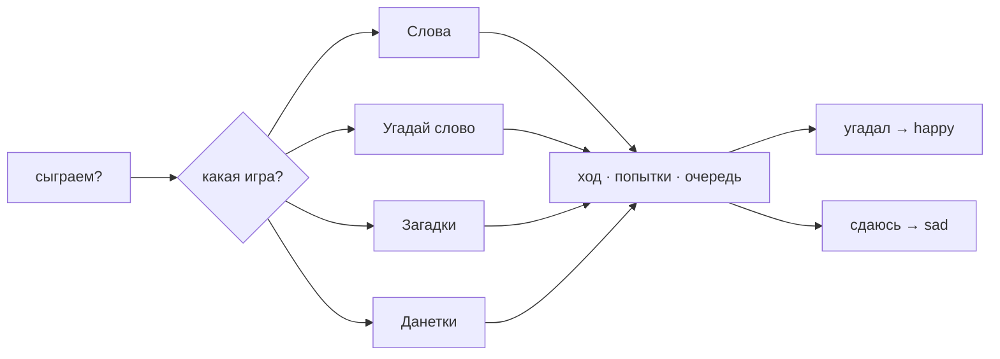
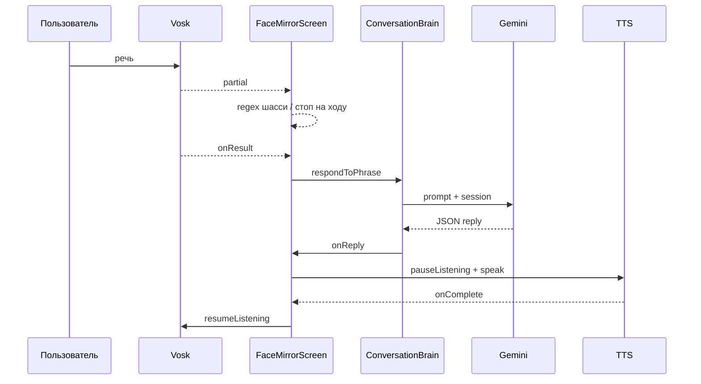
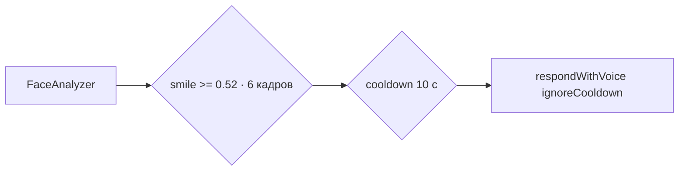

# Голосовая реализация

## Обзор

Голосовой модуль отвечает за:

1. **Распознавание речи** (STT) — непрерывное прослушивание на русском, офлайн Vosk
2. **Диалог** — ответы через Gemini LLM или локальные правила
3. **Память сессии** — ходы User / Jasper в следующем промпте
4. **Голосовые игры** — четыре партии внутри того же чата
5. **Голосовой ответ** (TTS) — с эмоциональным pitch/rate и lip sync
6. **Прерывание** — стоп-команды без LLM
7. **Реакции на жесты** — короткие фразы при улыбке пользователя (без LLM)

Текстовый overlay распознанной речи **убран** — на экране только лицо.



---

## Компоненты

### SpeechRecognizerEngine

`speech/SpeechRecognizerEngine.kt`

- Офлайн STT: Vosk `SpeechService` + модель `vosk-model-small-ru-0.22` (~45 MB в assets)
- Непрерывный `AudioRecord` 16 kHz / mono — без сессий Google и без `NO_MATCH`
- Partial-результаты идут потоком; команды шасси берутся с partial, чат — с endpoint (`onResult`)
- Модель скачивается Gradle-задачей `unpackVoskModel` при сборке, на устройстве копируется в `filesDir`

**Пауза при TTS:**

```kotlin
pauseListening()   // SpeechService.setPause(true) — микрофон открыт, аудио в распознаватель не идёт
resumeListening()  // reset + setPause(false) через 250 ms
acknowledgePhrase() // сброс recognizedText после обработки
consumeUtteranceAndRestart() // команда с partial: recognizer.reset(), без перезапуска микрофона
```

### ConversationBrain

`speech/ConversationBrain.kt`

- Оркестратор ответа на фразу
- Классификатор команд (`classifyDrive`) — только если regex не взял, но фраза похожа на руление (`chassisTalk`)
- Таймаут классификатора 6 с: при ошибке/таймауте идём в чат, разговор не глушится
- Только имя («Джаспер») — без Gemini, ждём команду (обрабатывается в `FaceMirrorScreen`)
- Если Gemini настроен → `LlmConversationResponder`, иначе → `GreetingDetector`
- Успешный чат пишется в `SessionTranscript` (user + jasper)
- `cancelPending()` — отмена предыдущего LLM-запроса при новой фразе или прерывании
- Callbacks: `onReply(GreetingReply)` / `onNoReply()` / `onDrive(DriveAction)`



### SessionTranscript

`speech/SessionTranscript.kt`

- Кольцевой лог до 50 ходов (`ChatTurn`)
- Живёт, пока жив `ConversationBrain` (сессия приложения, не диск)
- `snapshot()` уходит в промпт как `This session so far:`
- Пустые строки отбрасываются

### LlmConversationResponder

`speech/LlmConversationResponder.kt`

- Формирует промпт через `JasperLlmPrompt.build(phrase, session)`
- Парсит JSON-ответ: `should_reply`, `reply`, `expression`, `voice`
- Маппинг в `GreetingReply` (текст + `FaceExpression` + `VoiceEmotion`)
- `should_reply: false` → молчание (шум / неразборчиво)

### JasperLlmPrompt

`speech/JasperLlmPrompt.kt`

- Промпт на английском (экономия токенов), ответы — только русский
- Персона: любопытный ребёнок 5–7 лет
- Обычный чат: max 12 слов
- В игре можно чуть длиннее — только загадка или короткая данетка
- Не здороваться заново, если уже говорили
- Если игра уже предложена или идёт — играть ход, не приглашать заново и не менять игру без просьбы

**Ровно четыре игры:**

| # | Игра | Правила в промпте |
|---|------|-------------------|
| 1 | Слова | Следующее слово с последней буквы; ь/ы/ъ → предпоследняя; без выдуманных слов |
| 2 | Угадай слово | Уточняющие вопросы, без подсказок, 20 попыток, иначе «сдаюсь» + sad |
| 3 | Загадки | Детские загадки по очереди, 5 попыток, иначе «сдаюсь» + sad |
| 4 | Данетки | Вопросы только Да/Нет, 20 попыток, иначе «сдаюсь» + sad |

Угадал — `expression happy`. Счёт попыток и чья очередь — из лога сессии.

JSON:

```json
{"should_reply":true,"reply":"текст по-русски","expression":"happy","voice":"cartoon"}
```



### GreetingDetector

`speech/GreetingDetector.kt`

Локальный fallback без API. Regex-триггеры:

| Паттерн | Эмоции |
|---------|--------|
| привет, приветик, здравствуй | HAPPY, PLAYFUL |
| рад видеть, скучал, люблю | HAPPY |
| злюсь, бесит, разозли | ANGRY |
| боюсь, страшно, испугал | AFRAID |
| спать, сонн, устал | SLEEPY |
| не хочу видеть, уходи | OFFENDED, SAD |

### InterruptCommands

`speech/InterruptCommands.kt`

Мгновенные команды без LLM: `стоп`, `тише`, `тихо`, `подожди`, `замолчи`, `хватит`, `заткнись`.

→ `interruptJasper()`: stop TTS, cancel LLM, `DialogPhase.INTERRUPTED`, `chassisDriver.stop()`.

### JasperVoiceSpeaker

`audio/JasperVoiceSpeaker.kt`

- Android `TextToSpeech`, язык `ru-RU`
- `speakGreeting(reply: GreetingReply)` — pitch/rate из `VoiceEmotion`
- Выбор лучшего русского голоса (`pickRussianVoice`)
- `onSpeakingChanged(Boolean)` — флаг речи для UI
- `onRangeStart` → `onLipPulse(Float)` — синхронизация рта с фонемами
- Fallback-осцилляция рта, если `onRangeStart` не приходит

### JasperSoundPlayer

`audio/JasperSoundPlayer.kt`

- Синтез коротких тонов через `AudioTrack`
- `playGreeting()` — восходящая мелодия (4 ноты)
- В текущем UI **не вызывается** (legacy)

### FaceGestureReactions

`model/FaceGestureReactions.kt`

- `smileReply()` — случайная радостная фраза при улыбке пользователя
- Без LLM, cooldown 10 с

---

## Поток данных



### Реакция на улыбку (параллельный поток)



Не срабатывает во время THINKING / SPEAKING.

---

## GreetingReply и VoiceEmotion

```kotlin
data class GreetingReply(
    val text: String,
    val voice: VoiceEmotion,
    val expression: FaceExpression,
)
```

`pitch` и `speechRate` вычисляются из `VoiceEmotion`:

| VoiceEmotion | pitch | rate |
|--------------|-------|------|
| CARTOON | 1.9 | 1.18 |
| HAPPY | 1.35 | 1.12 |
| WARM | 1.1 | 1.0 |
| PLAYFUL | 1.55 | 1.22 |
| CALM | 0.95 | 0.88 |
| SAD | 0.88 | 0.85 |
| OFFENDED | 0.82 | 0.9 |
| ANGRY | 0.78 | 1.05 |
| AFRAID | 1.25 | 1.2 |
| SLEEPY | 0.82 | 0.72 |

---

## Защита от повторов и тайминги

| Константа | Значение | Назначение |
|-----------|----------|------------|
| `REPLY_COOLDOWN_MS` | 2500 | Минимальный интервал между ответами |
| `EXPRESSION_HOLD_MS` | 5000 | Удержание эмоции после ответа |
| `SMILE_REACTION_COOLDOWN_MS` | 10000 | Cooldown реакции на улыбку |
| `CLASSIFY_TIMEOUT_MS` | 6000 | Таймаут классификатора команд |
| `DEFAULT_MAX_TURNS` | 50 | Глубина лога сессии |

- `acknowledgePhrase()` — сбрасывает `recognizedText`, чтобы одна фраза не обрабатывалась дважды
- Во время `SPEAKING` входящие фразы отбрасываются (защита от эхо TTS)
- Команда с partial сбрасывает текущую реплику Vosk (`consumeUtteranceAndRestart`)

---

## Требования

- `RECORD_AUDIO` — микрофон
- `INTERNET` — только Gemini API (опционально); STT офлайн
- `gemini.api.key` в `local.properties` для LLM-ответов и классификатора команд

---

## Тесты

- `SessionTranscriptTest` — порядок, лимит, пустые строки
- `JasperLlmPromptTest` — четыре игры в промпте, блок сессии, `do not invite a new game`

---

## Известные ограничения

- STT паузится на время TTS — barge-in голосом отложен (эхо)
- Первая установка копирует ~45 MB модели в filesDir
- Качество TTS зависит от голосов устройства
- Без Gemini API — только локальные regex-реакции и regex-команды машинки
- Игры живут только в промпте: нет отдельной state machine, счёт попыток — ответственность Gemini по логу сессии

---

## Возможные улучшения

- Barge-in с AEC или tap-to-interrupt
- End-of-turn debounce на partial, если команды в одной фразе режутся рано
- Piper / cloud TTS для мультяшного голоса
- `CommandRouter` для игровых команд («закрой глаза»)
- Явная `GameSession` вместо «игр только в промпте»
