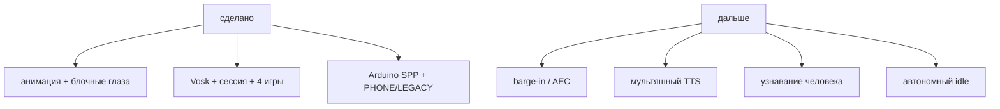
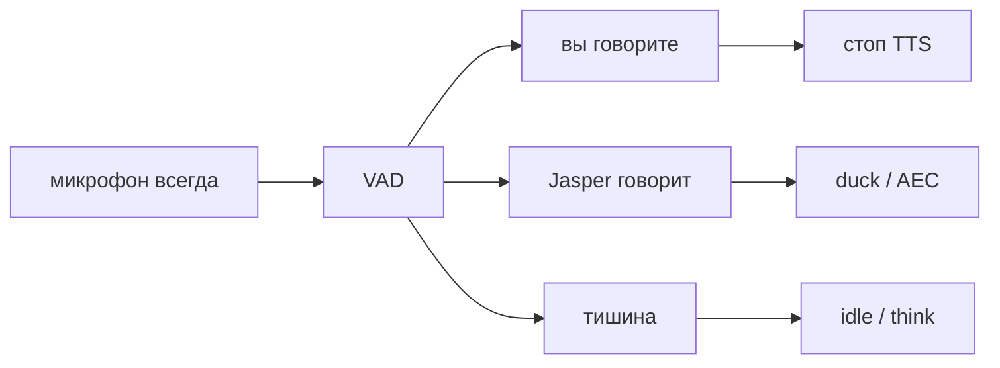
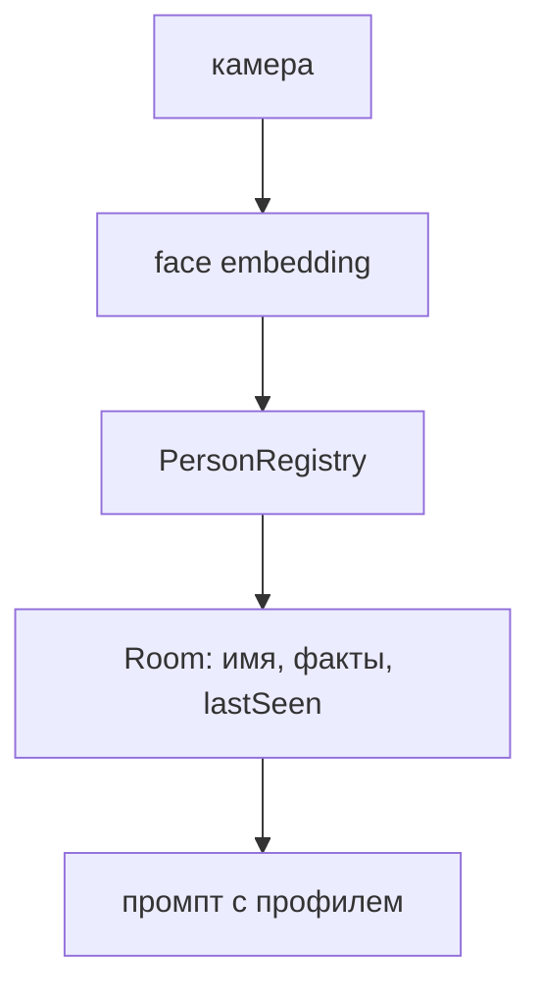
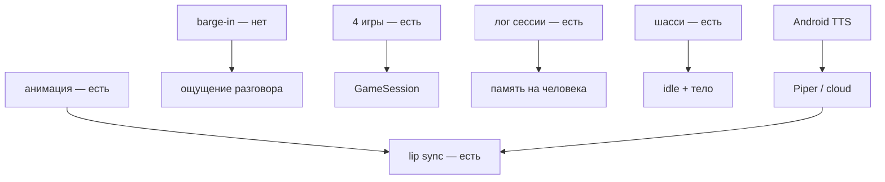

# Jasper — план развития

Документ описывает направления развития: от текущего компаньона (лицо + голос + игры + шасси) к персонажу с памятью между сессиями, barge-in и автономным поведением.

**Текущее состояние (`main` / `jasper10`):**

- Неоновое лицо: блочные глаза, брови, рот, 9 эмоций
- Взгляд следует за головой (yaw/pitch), idle-моргание, дыхание, lip sync
- Офлайн STT (Vosk) + Gemini или локальные правила
- Лог сессии до 50 ходов — не предлагает ту же игру повторно
- Четыре голосовые игры: Слова, Угадай слово, Загадки, Данетки
- Bluetooth-шасси: regex + классификатор, режимы PHONE / LEGACY
- Во время ответа микрофон на паузе — перебить голосом нельзя, только стоп-командой

---

## Приоритеты и фазы

| Фаза | Фокус | Статус |
|------|--------|--------|
| **1** | Плавность и отзывчивость | частично: idle + фазы есть, barge-in отложен |
| **2** | Голос и диалог | Vosk + сессия есть; мультяшный TTS нет |
| **3** | Игры и команды | 4 голосовые игры есть; команды лицу («моргни») нет |
| **4** | Распознавание человека и память | не начато (есть только лог текущей сессии) |
| **5** | Автономное поведение + Arduino | шасси есть; idle-характер нет |

---

## 1. Более анимированный мультяшный вид

**Цель:** Jasper ощущается «живым» — плавные, выразительные движения.

| Элемент | Сейчас | Ещё можно |
|---------|--------|-----------|
| Глаза | Блочные, squish по эмоции, saccades, idle-моргание | Независимый wink, landmarks |
| Брови | Дуги + фазы диалога | Дрожь при злости |
| Рот | Bezier + lipPulse | Формы фонем «о / э / м» |
| Общее | Bounce, дыхание, glow | Anticipation + follow-through |

Критерий готовности фазы 1 по анимации в целом выполнен (idle не застывший, рот в такт). Дальше — полировка.

---

## 2. Более чёткий отклик (перебивание, диалог)

**Цель:** Пользователь может перебить Jasper, диалог ощущается как разговор.

**Сейчас:** пока TTS говорит, Vosk на паузе. Стоп-команды работают, когда микрофон снова слушает. Отмена LLM при новой фразе во время THINKING — есть.

### Ещё сделать

1. **Barge-in** — STT не паузить; AEC или tap-to-interrupt
2. **End-of-turn** — пауза 400–700 мс после последнего partial → фраза завершена
3. Настраиваемый `REPLY_COOLDOWN_MS` для команд (для шасси уже обходится через partial)

---

## 3. Распознавание человека и персональная память

**Цель:** Jasper узнаёт людей между запусками приложения, обращается по имени.

Сейчас память — только `SessionTranscript` в RAM на время процесса.

Шаги те же: MediaPipe / TFLite на устройстве, голосовая регистрация «меня зовут …», факты из диалога, экран «удалить мои данные».

---

## 4. Настоящий мультяшный голос

**Цель:** Голос звучит как персонаж, а не как ускоренный системный TTS.

Сейчас: Android TTS + pitch/rate от `VoiceEmotion`.

Путь: абстракция `JasperVoiceEngine` → Android TTS / cloud / Piper.

---

## 5. Игры и голосовые команды

**Сделано:** четыре игры в промпте + стоп-команды + команды шасси.

**Ещё:**

| Команда | Действие |
|---------|----------|
| «Закрой глаза» / «Моргни» / «Подмигни» | анимация без LLM |
| «Улыбнись» / «Нахмурься» | смена `FaceExpression` |

Идеи игр сверх четырёх (камень-ножницы-бумага, эмоция-угадайка) — только если явно расширять промпт; сейчас другие игры запрещены.

Явная `GameSession` снимет зависимость счёта попыток от Gemini.

---

## 6. Автономное поведение

**Сделано:** Arduino едет по команде, PHONE не спорит с ультразвуком.

**Ещё (экран):**

| Поведение | Триггер | Действие |
|-----------|---------|----------|
| Скука | Нет лица 30 с | Взгляд бродит, зевок |
| Одиночество | Нет лица 2 мин | «Эй, кто-нибудь дома?» |
| Радость при возврате | лицо появилось | HAPPY + фраза |
| Самоигра | idle 5 мин | «Сыграем?» |

**Ещё (тело):** серво к лицу по yaw, LED по эмоции, «уезжает спать».

Протокол сейчас не JSON/BLE, а байты `%A#` по Classic SPP — менять только если понадобится телеметрия.

---

## Дополнительные идеи

- Экран настроек: LLM вкл/выкл, громкость, удаление памяти
- CI: GitHub Actions `./gradlew assembleDebug`
- Wake word «Эй, Jasper»
- Unit-тесты `DriveCommands`, `GreetingDetector`

---

## Зависимости между задачами

**Рекомендуемый порядок сейчас:**

1. Barge-in или tap-to-interrupt
2. Мультяшный TTS
3. `GameSession` / команды лицу
4. Лица и память между запусками
5. Idle-характер

---

## Метрики успеха

| Метрика | Цель |
|---------|------|
| Время реакции на команду шасси | < 300 мс (regex на partial) |
| Перебивание TTS | работает в 95% случаев |
| Узнавание знакомого лица | > 90% при хорошем свете |
| Длина сессии | пользователь остаётся > 5 мин |
| «Ощущение живого персонажа» | субъективно 8/10 |

---

## Следующий шаг

Barge-in (AEC или tap) — единственный крупный пробел фазы 1. Игры и шасси из фаз 3/5 уже в `main`.
