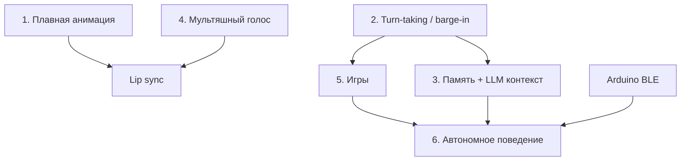

# Jasper — план развития

Документ описывает направления развития персонажа Jasper: от текущего MVP (неоновое лицо + голос + LLM) до «живого» компаньона с памятью, играми и телом.

**Текущее состояние (ветка `jasper1`):**
- Неоновое лицо: глаза, брови, рот, 9 эмоций
- Взгляд следует за головой пользователя (yaw/pitch)
- Распознавание речи (STT) + ответы через Gemini или локальные правила
- TTS с изменением pitch/rate (псевдо-мультяшный голос)
- Во время ответа микрофон на паузе — перебить нельзя

---

## Приоритеты и фазы

| Фаза | Фокус | Срок (оценка) |
|------|--------|---------------|
| **1** | Плавность и отзывчивость | 1–2 недели |
| **2** | Голос и диалог | 2–3 недели |
| **3** | Игры и команды | 2 недели |
| **4** | Распознавание человека и память | 3–4 недели |
| **5** | Автономное поведение + Arduino | 4+ недель |

Фазы можно частично параллелить (например, голос и анимация независимы).

---

## 1. Более анимированный мультяшный вид

**Цель:** Jasper ощущается «живым» — плавные, выразительные движения, а не просто переключение состояний.

### Что улучшить

| Элемент | Сейчас | Цель |
|---------|--------|------|
| Глаза | Spring-анимация open/close, взгляд по yaw/pitch | Микро-движения (saccades), редкое моргание в idle, squash & stretch при эмоциях |
| Брови | Дуги с `browInnerLift` / `browOuterLift` | Независимое движение левой/правой брови, «дрожь» при злости, медленное опускание при сонливости |
| Рот | Кривая Безье по `smileAmount` | Синхронизация с речью (lip sync), промежуточные формы («о», «э», «м») |
| Общее | Скачок при смене `FaceExpression` | Anticipation + follow-through, лёгкий bounce тела лица, пульс неона |

### Технические шаги

1. **Слой анимации** — вынести из `NeonFace` в `FaceAnimator` / `JasperFaceState`:
   - целевые значения от LLM/игр/idle
   - непрерывные параметры: `eyeOpenL/R`, `browInnerL/R`, `mouthShape`, `glowPhase`
2. **Idle-цикл** — когда лицо в кадре, но нет диалога:
   - случайное моргание каждые 3–7 с
   - лёгкое покачивание взгляда
   - «дыхание» (масштаб 1.0 ↔ 1.02)
3. **Lip sync при TTS** — анимировать рот по `onRmsChanged` / длительности фонем (сначала простой open/close по амплитуде, только пока Jasper говорит)
4. **Опционально: Rive / Lottie** — если Canvas станет сложным, перенести лицо в векторную анимацию с таймлайном

### Критерий готовности

- Смена эмоции занимает 300–600 мс с видимым переходом
- В idle лицо не «застывшее» минимум 30 с без повторов
- При речи рот двигается в такт (хотя бы грубо)

---

## 2. Более чёткий отклик (перебивание, диалог)

**Цель:** Пользователь может перебить Jasper, диалог ощущается как разговор, а не монолог.

### Проблема сейчас

```text
Фраза → LLM → TTS → pauseListening() … resumeListening()
```

Пока TTS говорит, Vosk на паузе (`setPause`). Новая фраза не обрабатывается.

### Решение: turn-taking (очередь реплик)

```text
                    ┌─────────────────┐
  Микрофон ────────►│ Voice Activity  │
                    │ + STT (always)  │
                    └────────┬────────┘
                             │
              ┌──────────────┼──────────────┐
              ▼              ▼              ▼
        [User speaking] [Jasper speaking] [Silence]
              │              │              │
              ▼              ▼              ▼
        stop TTS         continue      idle / think
        flush queue      or duck mic
```

### Технические шаги

1. **Barge-in (перебивание)**
   - Не останавливать STT на время TTS; использовать `AudioManager` / ducking или отдельный канал
   - При `onBeginningOfSpeech` во время TTS → `voiceSpeaker.stop()`, сброс `isReplying`, новая фраза в приоритет
2. **Детектор конца реплики (end-of-turn)**
   - Пауза 400–700 мс после последнего partial result → считать фразу завершённой
   - Не слать в LLM каждый промежуточный partial
3. **Очередь и отмена**
   - Если пришла новая фраза пока LLM думает → отменить предыдущий `Job` (coroutine)
   - Короткие междометия («стоп», «подожди») — локально без LLM
4. **Состояния диалога** — enum `DialogPhase`: `Listening`, `Thinking`, `Speaking`, `Interrupted`
5. **Визуальная обратная связь** — лёгкая эмоция «слушаю» (чуть приподнятые брови) vs «думаю» (взгляд вверх)

### Критерий готовности

- Пользователь может перебить ответ за < 500 мс
- Нет «залипания» на старой фразе после перебивания
- Cooldown 2.5 с (`REPLY_COOLDOWN_MS`) настраивается или убран для команд

---

## 3. Распознавание человека и персональная память

**Цель:** Jasper узнаёт конкретных людей, обращается по имени и помнит контекст.

### Архитектура

```text
Камера → Face embedding (вектор лица)
              │
              ▼
        PersonRegistry          PersonMemory (Room DB)
        id, name, embedding  ← interests, facts, lastSeen
              │
              ▼
        ConversationBrain + system prompt с профилем
```

### Технические шаги

1. **Идентификация лица**
   - Вариант A: **ML Kit Face Detection** + собственные эмбеддинги (MediaPipe Face Embedder, ONNX MobileFaceNet)
   - Вариант B: **Android Biometric / Face API** — ограниченно, не для произвольных лиц
   - Рекомендация: MediaPipe Tasks или TFLite модель на устройстве (без отправки фото в облако)
2. **Регистрация** — голосовая команда: «Меня зовут …» + лицо в кадре 2–3 с → сохранить embedding + имя
3. **Сопоставление** — cosine similarity > порога → `currentPersonId`
4. **Память на человека** (Room):
   - `name`, `createdAt`, `lastSeenAt`, `faceEmbedding` (BLOB)
   - `facts: List<String>` — интересы, предпочтения (из диалогов)
   - `conversationSummary` — сжатая история (обновлять через LLM раз в N реплик)
5. **Извлечение фактов** — после диалога LLM: «извлеки 0–2 факта о пользователе» → append в профиль
6. **Приватность** — всё локально; экран «Удалить мои данные»; явное согласие при первой регистрации

### Критерий готовности

- До 5–10 зарегистрированных людей, узнавание за < 1 с
- «Привет, Сергей» при возврате в кадр
- «Ты же любил космос — как дела с телескопом?» (если факт был сохранён)

---

## 4. Настоящий мультяшный голос

**Цель:** Голос звучит как персонаж, а не как ускоренный системный TTS.

### Варианты (от простого к сложному)

| Подход | Плюсы | Минусы |
|--------|-------|--------|
| **TTS + pitch** (сейчас) | Бесплатно, офлайн | Ограниченно «мультяшно» |
| **Сторонний TTS API** (ElevenLabs, PlayHT, Yandex SpeechKit с эмоциями) | Качество, стиль | API ключ, сеть, стоимость |
| **Предзаписанные фразы** | Идеальное звучание для игр | Не масштабируется на свободный диалог |
| **Neural TTS on-device** (Piper, Sherpa-ONNX) | Офлайн, свой голос | Размер модели, настройка |
| **Voice conversion** поверх TTS | Один стиль на любой текст | Сложность, задержка |

### Рекомендуемый путь

1. **Краткосрочно:** Yandex SpeechKit / Google Cloud TTS с выбором «детского» голоса + кэш частых фраз
2. **Среднесрочно:** Piper TTS (русская модель) в assets + воспроизведение через ONNX
3. **Абстракция** — интерфейс `JasperVoiceEngine`:
   ```kotlin
   interface JasperVoiceEngine {
       fun speak(text: String, emotion: VoiceEmotion, onComplete: () -> Unit)
       fun stop()
   }
   ```
   Реализации: `AndroidTtsEngine`, `CloudCartoonEngine`, `PiperEngine`

### Дополнительно

- Звуковые эффекты между фразами (лёгкий «бип», вдох)
- Разный голос для эмоций (злость — ниже, испуг — выше)
- Синхронизация с анимацией рта (см. п. 1)

### Критерий готовности

- Слепой тест: «это мультяшный персонаж» ≥ 7/10
- Задержка до начала речи < 800 мс (облако) или < 300 мс (кэш/офлайн)

---

## 5. Игры и голосовые команды

**Цель:** Jasper реагирует на чёткие команды и предлагает простые игры.

### Команды (локально, без LLM)

| Команда | Действие |
|---------|----------|
| «Закрой глаза» / «Открой глаза» | `eyeOpen` → 0 / 1 |
| «Моргни» | одноразовая анимация blink |
| «Улыбнись» / «Нахмурься» | `FaceExpression.HAPPY` / `ANGRY` |
| «Подмигни» | wink левым/правым |
| «Стоп» / «Тихо» | stop TTS + neutral |

Реализация: `CommandRouter` перед `ConversationBrain` — regex / fuzzy match, latency < 100 мс.

### Игры

**Камень-ножницы-бумага**
1. Jasper: «На раз, два, три!»
2. Анимация «раз-два-три» + случайный жест на «три»
3. Пользователь показывает жест (опционально: распознавание руки MediaPipe Hands — фаза 2)
4. Пока без камеры руки: только голос «я выбрал камень», пользователь говорит свой вариант

**Другие идеи**
- «Угадай число» (1–10)
- «Считалочка» / короткие стихи
- «Повтори за мной» (эхо с искажением голоса)
- «Что я за эмоция?» — показывает эмоцию, пользователь угадывает

### Технические шаги

1. `GameMode` enum + `GameSession` state machine
2. В игровом режиме LLM не вызывается (или только для болтовни между раундами)
3. Визуальные эффекты победы/поражения (вспышка, PLAYFUL → HAPPY)

### Критерий готовности

- 5+ команд работают без интернета
- Одна полноценная игра (камень-ножницы-бумага) от начала до конца

---

## 6. Автономное поведение (без пользователя)

**Цель:** Когда никто не говорит, Jasper не «замирает» — проявляет характер.

### Пока без Arduino (только экран)

| Поведение | Триггер | Действие |
|-----------|---------|----------|
| Скука | Нет лица 30 с | Взгляд бродит, зевок (SLEEPY) |
| Одиночество | Нет лица 2 мин | «Эй, кто-нибудь дома?» (если был звук) |
| Радость при возврате | `isDetected` false → true | HAPPY + короткая фраза |
| Самоигра | Idle 5 мин + лицо есть | «Сыграем?» → предложение игры |
| Микро-реплики | Случайно раз в 10–20 мин | Короткая фраза из пула (без LLM) |

Реализация: `IdleBehaviorEngine` с таймерами и приоритетом ниже, чем у диалога.

### С Arduino-машинкой (фаза 5)

```text
Android (Jasper app)  ←──BLE/Serial──→  Arduino
     │                                      │
  лица, голос, LLM                    моторы, LED,
                                      датчики расстояния
```

**Идеи для тела**
- Поворот «головы» к лицу (серво по yaw)
- Подъезд к человеку (ультразвук + моторы)
- Мигание LED при эмоциях
- «Уезжает спать» при долгом idle

**Протокол** — простой JSON по BLE:
```json
{"cmd":"drive","dir":"forward","ms":500}
{"cmd":"emotion","led":"happy"}
{"evt":"obstacle","cm":12}
```

### Критерий готовности (экран)

- 3+ автономных поведения без краша и без спама речью
- Поведение отключается, когда пользователь говорит

---

## Дополнительные идеи (рекомендации)

### UX и надёжность
- **Экран настроек** — чувствительность, вкл/выкл LLM, громкость, удаление памяти
- **Индикатор состояния** — тонкая точка: слушает / думает / говорит (без текста снизу)
- **Офлайн-режим** — только локальные команды и `GreetingDetector`, без Gemini

### Характер
- **Настроение Jasper** — долгоживущее: после грубости → OFFENDED дольше; после игры → PLAYFUL
- **Время суток** — утром бодрее, ночью SLEEPY (если не отключено)

### Техническое качество
- **Unit-тесты** для `CommandRouter`, `GreetingDetector`, `PersonRegistry`
- **Обновить `.memory-bank/technical.md`** — убрать устаревшее про `RecognizedWordsOverlay`
- **CI** — GitHub Actions: `./gradlew assembleDebug`

### Контент
- **Сценарии для детей** — сказка по главам, где Jasper задаёт вопросы
- **Обучение** — «как сказать по-английски …» с повторением

### Аппаратная интеграция
- **Подставка с планшетом** — планшет = лицо, Arduino = шасси
- **Wake word** «Эй, Jasper» — Porcupine / openWakeWord (опционально, батарея)

---

## Зависимости между задачами



**Рекомендуемый порядок старта:**
1. Turn-taking (п. 2) — сразу улучшит ощущение продукта
2. Плавная анимация + lip sync (п. 1)
3. Голосовые команды и одна игра (п. 5)
4. Мультяшный TTS (п. 4)
5. Лица и память (п. 3)
6. Idle + Arduino (п. 6)

---

## Метрики успеха (через 2–3 месяца)

| Метрика | Цель |
|---------|------|
| Время реакции на команду | < 300 мс (локальные) |
| Перебивание TTS | работает в 95% случаев |
| Узнавание знакомого лица | > 90% при хорошем свете |
| Длина сессии | пользователь остаётся > 5 мин |
| «Ощущение живого персонажа» | субъективно 8/10 |

---

## Следующий шаг

**Фаза 1, спринт 1:** реализовать barge-in и `DialogPhase` (п. 2), параллельно — idle-моргание и micro-saccades (п. 1).

После согласования плана — разбить спринт 1 на задачи в issues / TODO.
