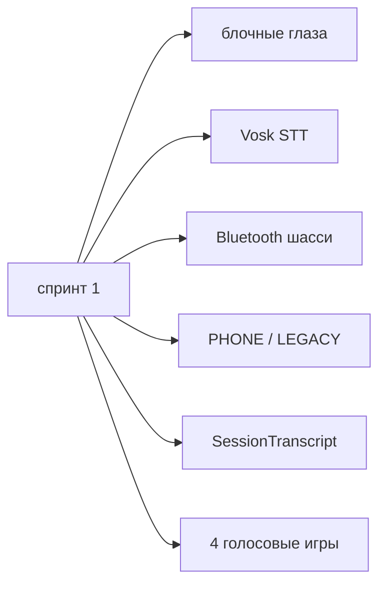

# Спринт 1 — отзывчивость и живость

**Цель:** Jasper можно перебить; лицо живое в idle.  
**Срок:** ~1–2 недели  
**Ветка:** `jasper1` → влит в `main`  
**Статус:** закрыт. Barge-in так и не вошёл (эхо TTS). Анимация idle и стоп-команды — в проде.

Исторический снимок. Актуальное состояние: `.memory-bank/business.md`, `.memory-bank/roadmap.md`.

---

## Задачи

### A. Диалог и перебивание (п. 2 roadmap)

| # | Задача | Статус | Файлы |
|---|--------|--------|-------|
| A1 | `DialogPhase` — состояния IDLE / LISTENING / THINKING / SPEAKING / INTERRUPTED | ✅ | `model/DialogPhase.kt` |
| A2 | Barge-in: STT не ставится на паузу во время TTS | ⏸ отложено | эхо ловит свой голос |
| A3 | При речи пользователя во время TTS → `stop()` + сброс | ⏸ отложено | нужен AEC или tap-to-interrupt |
| A4 | Отмена LLM-запроса при новой фразе / прерывании | ✅ | `ConversationBrain.kt` |
| A5 | Локальные стоп-команды: «стоп», «тихо», «подожди» | ✅ | `speech/InterruptCommands.kt` |
| A6 | Убрать жёсткий cooldown после перебивания | ✅ | `FaceMirrorScreen.kt` |

### B. Живая анимация (п. 1 roadmap)

| # | Задача | Статус | Файлы |
|---|--------|--------|-------|
| B1 | Случайное моргание каждые 3–7 с (лицо в кадре) | ✅ | двойное моргание, все эмоции кроме SLEEPY |
| B2 | Микро-saccades — лёгкие скачки взгляда | ✅ | spring-анимация + idle drift |
| B3 | «Дыхание» — пульс масштаба | ✅ | `NeonFace.kt` |
| B4 | Визуал фаз: слушаю (брови ↑) / думаю (взгляд ↑) | ✅ | `NeonFace.kt` |
| B5 | Squash & stretch при смене эмоции | ✅ | `NeonFace.kt` |
| B6 | Lip sync при TTS | ✅ | `JasperVoiceSpeaker` + `NeonFace` |

### C. Тест и приёмка

| # | Критерий | Статус |
|---|----------|--------|
| C1 | Перебить Jasper голосом за < 500 мс | ⬜ не сделано (A2/A3 отложены) |
| C2 | «Стоп» мгновенно замолкает | ✅ когда микрофон слушает |
| C3 | Новая фраза отменяет старый LLM-ответ | ✅ |
| C4 | Лицо моргает в idle ≥ 30 с без повторов | ✅ |

---

## Что вошло позже (не этот спринт)

---

## Следующий шаг (актуально)

См. `.memory-bank/roadmap.md`: barge-in, мультяшный TTS, память на человека, idle-характер.
