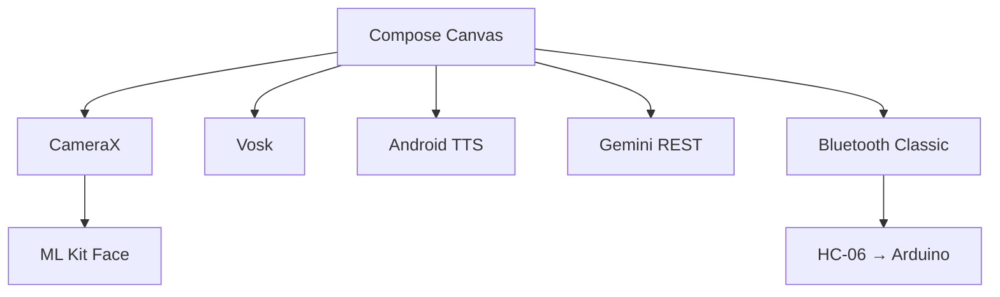
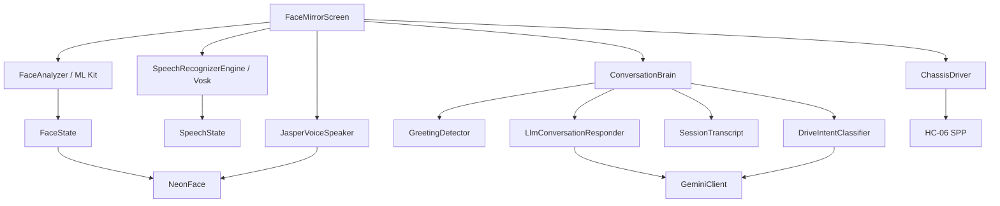
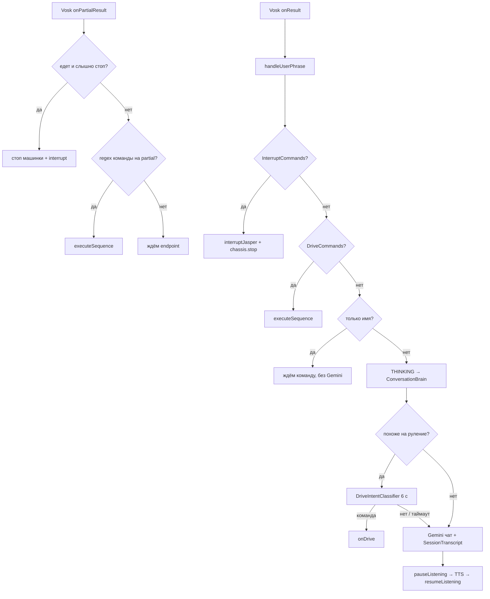
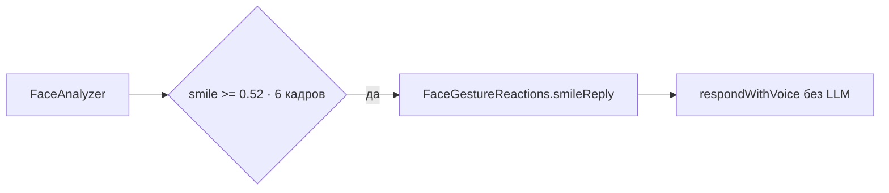

# Jasper — техническая спецификация

**Ветка:** `main` / `jasper10`  
**Пакет:** `com.jasper.facemirror`  
**Обновлено:** после Vosk, сессии диалога, игр и Bluetooth-шасси

---

## Стек

| Слой | Технология |
|------|------------|
| Язык | Kotlin |
| UI | Jetpack Compose, Canvas |
| Камера | CameraX (`ImageAnalysis`, 320×240) |
| Лицо (детекция) | ML Kit Face Detection (FAST, CLASSIFICATION_MODE_ALL) |
| Речь (STT) | Vosk (`vosk-android` 0.3.75 + `vosk-model-small-ru-0.22`), офлайн |
| Голос (TTS) | Android `TextToSpeech`, `ru-RU` |
| LLM | Google Gemini REST API (`generateContent`) |
| Шасси | Bluetooth Classic SPP → HC-06, протокол `%A#` |
| Асинхронность | Kotlin Coroutines |
| Сборка | Gradle 8.9, AGP 8.7, Java 17, minSdk 26, targetSdk 35 |



---

## Архитектура



Оркестратор — `FaceMirrorScreen`: камера, речь, диалог, эмоции и шасси. Текста на экране нет.

### Поток фразы



### Поток реакции на улыбку



Cooldown 10 с. Не срабатывает во время THINKING / SPEAKING.

---

## Структура проекта

```text
app/src/main/kotlin/com/jasper/facemirror/
├── MainActivity.kt
├── model/
│   ├── FaceState.kt           — данные с камеры (глаза, улыбка, yaw/pitch/roll)
│   ├── FaceExpression.kt      — 9 эмоций + параметры рта/бровей/глаз
│   ├── DialogPhase.kt         — IDLE / LISTENING / THINKING / SPEAKING / INTERRUPTED
│   ├── SpeechState.kt         — partial/recognized text, history, флаги
│   ├── GreetingReply.kt       — text + VoiceEmotion + FaceExpression → pitch/rate
│   └── FaceGestureReactions.kt — локальные реакции на улыбку
├── camera/
│   └── FaceAnalyzer.kt        — ML Kit → FaceState
├── speech/
│   ├── SpeechRecognizerEngine.kt  — Vosk STT, pause/resume, acknowledgePhrase
│   ├── VoskModelStore.kt          — распаковка model-ru из assets
│   ├── ConversationBrain.kt       — классификатор → чат, отменяемые запросы
│   ├── LlmConversationResponder.kt — парсинг JSON-ответа Gemini
│   ├── JasperLlmPrompt.kt         — персона, 4 игры, лог сессии
│   ├── SessionTranscript.kt       — до 50 ходов User/Jasper
│   ├── GreetingDetector.kt        — локальные regex-триггеры
│   └── InterruptCommands.kt       — стоп-команды
├── llm/
│   └── GeminiClient.kt        — REST, fallback по моделям
├── chassis/
│   ├── ChassisDriver.kt       — Bluetooth SPP, PHONE keepalive, очередь импульсов
│   ├── DriveCommands.kt       — regex голоса → DriveAction
│   └── DriveIntentClassifier.kt — Gemini, если regex не взял кривой STT
├── audio/
│   ├── JasperVoiceSpeaker.kt  — TTS, onRangeStart → lipPulse
│   └── JasperSoundPlayer.kt   — синтез тонов (legacy)
├── debug/
│   └── JasperTiming.kt        — лог задержек STT / LLM / шасси
└── ui/
    ├── FaceMirrorScreen.kt    — главный экран
    └── NeonFace.kt            — блочные глаза + анимации

arduino/jasper_chassis/        — прошивка PHONE / LEGACY
```

---

## Ключевые модели

### FaceState (с камеры)

```kotlin
leftEyeOpen, rightEyeOpen  // 0..1
smile                    // 0..1 (smilingProbability)
yaw, pitch, roll         // углы головы (yaw инвертирован для фронталки)
isDetected
```

### FaceExpression (от LLM / реакций)

9 значений: `NEUTRAL`, `HAPPY`, `PLAYFUL`, `SAD`, `OFFENDED`, `SURPRISED`, `ANGRY`, `AFRAID`, `SLEEPY`.

Каждое задаёт `smileAmount`, `eyeOpen`, `browInnerLift`, `browOuterLift`.

### GreetingReply

```kotlin
text: String
voice: VoiceEmotion      // → pitch + speechRate
expression: FaceExpression
```

### SpeechState

```kotlin
partialText, recognizedText, recognizedAlternatives
history (до 5 фраз)
isListening, isSpeaking
```

### SessionTranscript

Живёт вместе с `ConversationBrain`. Хранит до `DEFAULT_MAX_TURNS = 50` ходов (`ChatTurn.fromJasper` + `text`). Снимок уходит в `JasperLlmPrompt`, чтобы не предлагать ту же игру и не здороваться заново.

### DriveAction

| Действие | Код | Импульс |
|----------|-----|---------|
| FORWARD / BACKWARD / STRAFE_* | A B C D | 2500 мс |
| ROTATE_LEFT / ROTATE_RIGHT | E F | 600 мс |
| FOLLOW / WANDER | W T | без удержания (мозг Arduino) |
| STOP / CONNECT | S / reconnect | — |

---

## LLM-интеграция

### Конфигурация

`local.properties` → `gemini.api.key` → `BuildConfig.GEMINI_API_KEY`

### Модели (fallback chain)

1. `gemini-3.1-flash-lite-preview`
2. `gemini-flash-latest`
3. `gemini-2.0-flash`

Классификатор команд (`DriveIntentClassifier`) вызывает только первую модель, `temperature=0.1`, таймаут 5 с (мозг ждёт до 6 с). Чат идёт по полной цепочке.

### Промпт (`JasperLlmPrompt`)

- Язык промпта: английский (экономия токенов)
- Ответ: JSON `{"should_reply", "reply", "expression", "voice"}`
- Ответ пользователю: только русский; max 12 слов в чате, длиннее — только загадка / данетка
- Персона: любопытный ребёнок 5–7 лет
- Ровно четыре игры; нельзя предлагать другие и нельзя повторять приглашение, если игра уже шла
- В промпт вставляется `This session so far:` со всеми ходами User / Jasper

### Отмена запросов

`ConversationBrain.cancelPending()` — при новой фразе во время THINKING или при `interruptJasper()`.

---

## Анимации (`NeonFace`)

| Эффект | Реализация |
|--------|------------|
| Смена эмоции | `animateFloatAsState` (spring) для рта, бровей, глаз |
| Idle-моргание | `LaunchedEffect` + random delay 3–7 с, двойное моргание |
| Saccades | spring-анимация взгляда + idle drift |
| Дыхание | `infiniteTransition`, scale ~0.99 ↔ 1.02 |
| Squash & stretch | `animateFloatAsState` при смене `expression` |
| Lip sync | `lipPulse` от TTS `onRangeStart` + fallback-осцилляция |
| Фазы диалога | `dialogBrowInnerAdjust` / `dialogBrowOuterAdjust` / gaze offset |
| Глаза | `drawBlockEye` — прямоугольная рамка + синий блок-зрачок |

**Важно:** значения из `Animatable` внутри `Canvas` не триггерят recomposition — использовать `mutableFloatStateOf` + `animateFloatAsState`.

---

## Микрофон и TTS

### Конфликт STT ↔ TTS

Vosk и TTS конкурируют за микрофон. На время ответа:

```kotlin
speechEngine.pauseListening()  // SpeechService.setPause(true)
// ... TTS ...
speechEngine.resumeListening() // reset + setPause(false) через 250 ms
```

Команда с partial: `consumeUtteranceAndRestart()` — `recognizer.reset()`, микрофон не перезапускается.

### Barge-in

Отложен. STT во время TTS не активен — эхо TTS вызывает ложные срабатывания. Прерывание только через `InterruptCommands`.

### Пороги и тайминги (`FaceMirrorScreen`)

| Константа | Значение | Назначение |
|-----------|----------|------------|
| `REPLY_COOLDOWN_MS` | 2500 | Минимальный интервал между ответами |
| `EXPRESSION_HOLD_MS` | 5000 | Возврат к NEUTRAL после ответа |
| `SMILE_THRESHOLD` | 0.52 | Порог улыбки для реакции |
| `SMILE_HOLD_FRAMES` | 6 | Кадров удержания улыбки |
| `SMILE_REACTION_COOLDOWN_MS` | 10000 | Cooldown реакции на улыбку |
| `CLASSIFY_TIMEOUT_MS` | 6000 | Таймаут Gemini-классификатора команд |

---

## Разрешения

- `CAMERA` — фронтальная камера (только `ImageAnalysis`, без preview)
- `RECORD_AUDIO` — микрофон для STT
- `INTERNET` — Gemini API (STT офлайн)
- `BLUETOOTH` / `BLUETOOTH_ADMIN` (API ≤ 30), `BLUETOOTH_CONNECT` (API 31+)

---

## Потоки выполнения

- Анализ камеры — `Executors.newSingleThreadExecutor()`, callback на main thread
- ML Kit callbacks — main executor
- Vosk SpeechService — callbacks на main thread (`Handler`)
- TTS lip pulse — main thread
- LLM-запросы — `Dispatchers.IO`, результат на `Dispatchers.Main`
- Bluetooth write / keepalive — `Dispatchers.IO`
- UI-анимации — Compose recomposition + coroutines в `LaunchedEffect`

---

## Сборка и конфигурация

```bash
cp local.properties.example local.properties
./gradlew assembleDebug
```

Первая сборка скачивает `vosk-model-small-ru-0.22` (~45 MB) задачей `unpackVoskModel`.

- `local.properties` и `app/build/` в `.gitignore`
- `local.properties.example` — шаблон с `gemini.api.key`

Прошивка шасси: `arduino/README.md`.

---

## Зависимости

- `androidx.camera:*` 1.4.1
- `com.google.mlkit:face-detection` 16.1.7
- `com.alphacephei:vosk-android` 0.3.75
- `androidx.compose:*` (BOM 2024.12.01)
- `androidx.compose.animation:animation`
- `kotlinx-coroutines-android` 1.9.0
- `androidx.lifecycle:lifecycle-runtime-compose` 2.8.7

---

## Тесты

- `SessionTranscriptTest` — порядок ходов, лимит, пустые строки
- `JasperLlmPromptTest` — четыре игры, блок сессии, запрет повторного приглашения

---

## Известные ограничения

- STT паузится на время TTS — barge-in отложен
- TTS качество зависит от голосов устройства; выбирается лучший русский голос
- Локальная сборка требует JDK 17 (AGP 8.7)
- `JasperSoundPlayer` есть, но в текущем UI не вызывается
- Текст на экране не показывается (`RecognizedWordsOverlay` удалён)
- Шасси ищется среди сопряжённых устройств по имени (HC-06, HC-05, linvor, …)
