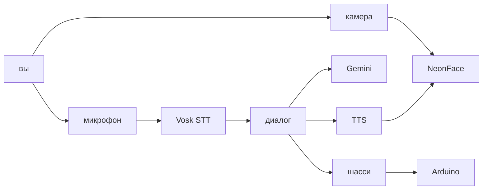
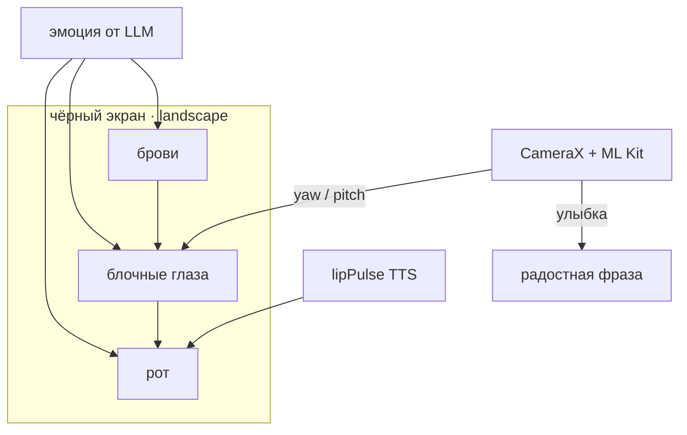
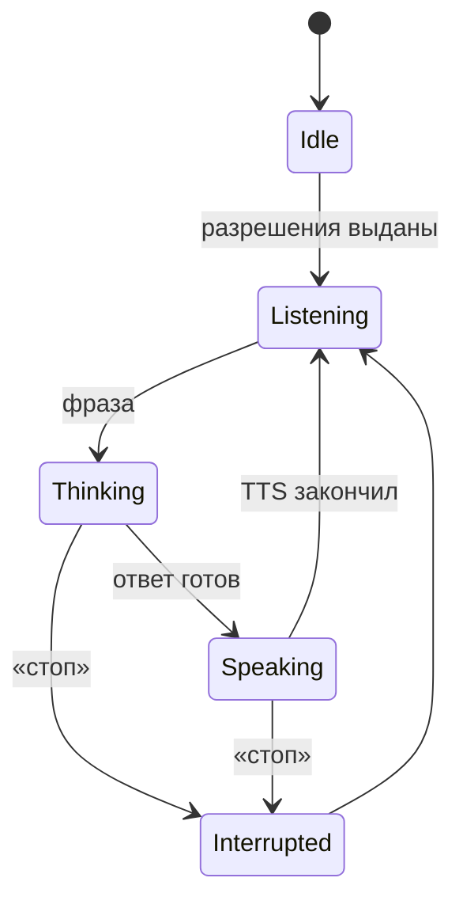
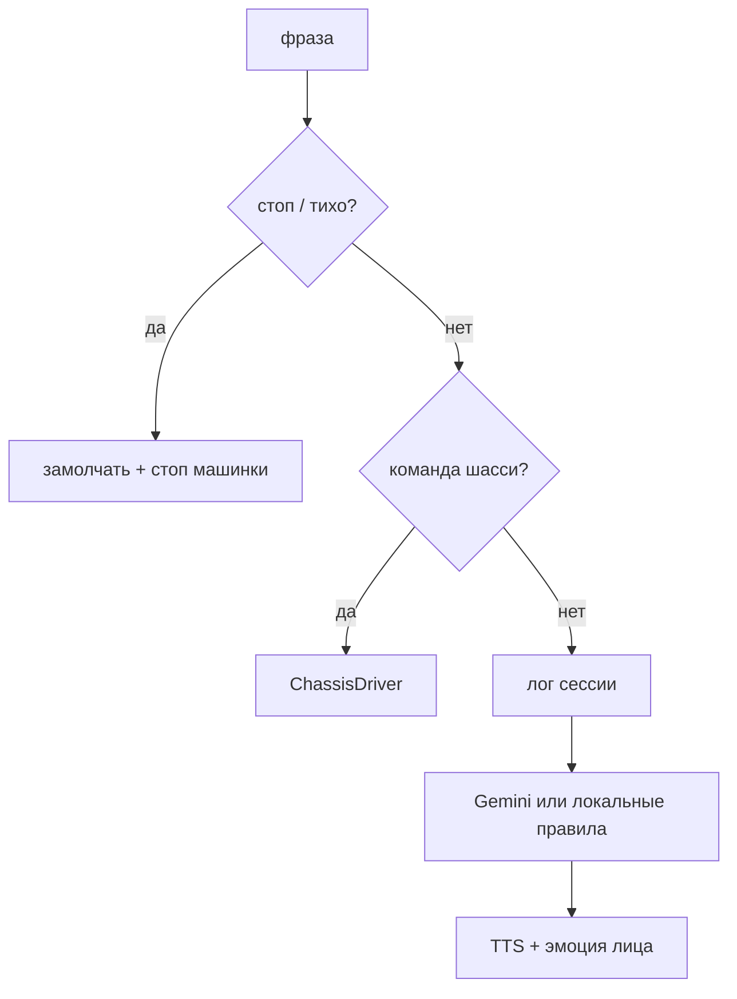
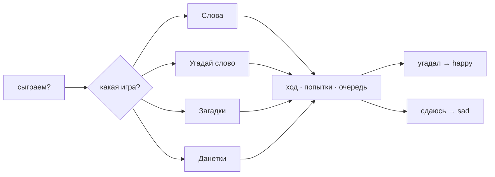
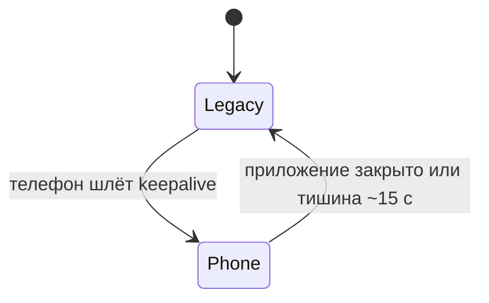
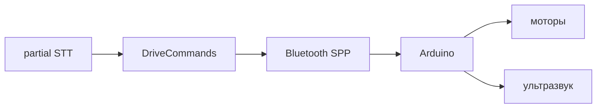
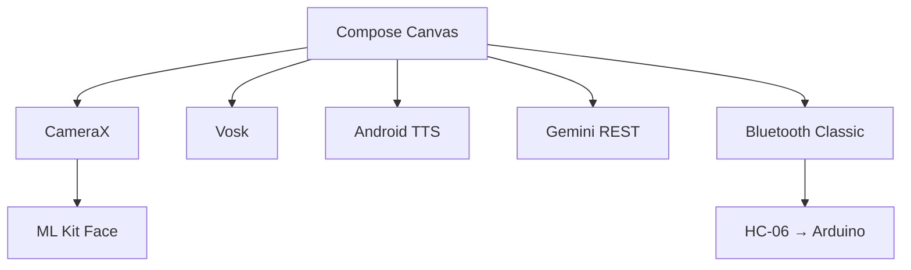

# Jasper

Интерактивный неоновый персонаж для Android: говорит, играет в слова и загадки, смотрит на вас через фронтальную камеру и ездит на Arduino-машинке по голосовым командам.

## Что это

Jasper — мультяшное лицо на чёрном экране: крупные блочные глаза, брови, рот. Персонаж ведёт голосовой диалог на русском, реагирует на фразы и улыбку, моргает и «дышит» в idle. Телефон можно поставить на шасси — тогда Jasper ещё и едет, когда его просят.

Характер — любопытный ребёнок 5–7 лет: короткие тёплые ответы, радуется похвале и играм.



## Возможности

### Лицо

- **9 эмоций** — happy, playful, sad, offended, surprised, angry, afraid, sleepy, neutral
- **Живая анимация** — моргание, saccades, дыхание, squash & stretch, lip sync при речи
- **Взгляд** — зрачки следуют за поворотом вашей головы
- **Реакция на улыбку** — Jasper замечает улыбку и радуется



### Голос и диалог

- **Голосовой диалог** — говорите с Jasper, он отвечает (Gemini LLM или локальные правила)
- **Офлайн STT** — Vosk на устройстве, без Google Speech и без обрывов на `NO_MATCH`
- **Память сессии** — последние реплики уходят в Gemini, чтобы не здороваться заново и не предлагать ту же игру повторно
- **Стоп-команды** — «стоп», «тихо», «подожди» мгновенно прерывают речь





### Голосовые игры

Четыре игры в промпте; Jasper сам ведёт очередь, попытки и «сдаюсь»:

| Игра | Правила |
|------|---------|
| **Слова** | По очереди называете слова: следующее начинается с последней буквы предыдущего |
| **Угадай слово** | Один загадывает, другой задаёт уточняющие вопросы (до 20 попыток) |
| **Загадки** | Детские загадки по очереди (до 5 попыток) |
| **Данетки** | Короткая история и вопросы только «да» / «нет» (до 20 попыток) |



### Машинка

Голосовые команды по Bluetooth Classic (HC-06) на Arduino-шасси. Команды руления берутся с partial STT — не нужно ждать конца фразы.

| Команда | Действие |
|---------|----------|
| «Джаспер, вперёд / назад / налево / направо» | Едет в эту сторону |
| «боком налево / направо» | Сдвиг боком |
| «погуляй» | Объезд препятствий (мозг машинки) |
| «за мной» | Следование за объектом |
| «стоп» | Стоп |
| «подключись» / «блютуз» | Переподключить Bluetooth |

Пока телефон на связи, Arduino в режиме **PHONE**: ультразвук не перебивает «вперёд». Без телефона — **LEGACY**, машинка снова рулит сама. Подробности: [`arduino/README.md`](arduino/README.md).





## Стек

| Компонент | Технология |
|-----------|------------|
| UI | Kotlin, Jetpack Compose, Canvas |
| Камера | CameraX + ML Kit Face Detection |
| Речь | Vosk (`vosk-model-small-ru-0.22`), офлайн |
| TTS | Android `TextToSpeech` (`ru-RU`) |
| LLM | Google Gemini REST API |
| Шасси | Bluetooth Classic SPP → Arduino (HC-06) |
| Сборка | Gradle 8.9, AGP 8.7, Java 17, minSdk 26, targetSdk 35 |



## Быстрый старт

### Требования

- Android Studio Ladybug или новее
- JDK 17
- Устройство Android 8+ (API 26) с фронтальной камерой и микрофоном
- Интернет только для Gemini (STT работает офлайн)
- Опционально: Arduino-машинка с HC-06, прошивка из `arduino/`

### Запуск

1. Клонируйте репозиторий
2. Откройте в Android Studio
3. (Опционально) Скопируйте `local.properties.example` → `local.properties` и добавьте ключ Gemini:

   ```properties
   gemini.api.key=YOUR_KEY_HERE
   ```

   Ключ: [Google AI Studio](https://aistudio.google.com/apikey)

4. Run → `app` (первая сборка скачает модель Vosk ~45 MB)
5. Разрешите доступ к камере, микрофону и Bluetooth

Без ключа Gemini Jasper отвечает только на ключевые слова (привет, злюсь, боюсь и т.д.) и команды машинки.

### Сборка из терминала

```bash
./gradlew assembleDebug
```

### Прошивка шасси

См. [`arduino/README.md`](arduino/README.md): скетч `jasper_chassis.ino`, плата Arduino Uno, Bluetooth на `A0`/`A1`.

## Структура проекта

```
app/src/main/kotlin/com/jasper/facemirror/
├── MainActivity.kt
├── model/          — FaceState, FaceExpression, DialogPhase, GreetingReply
├── camera/         — FaceAnalyzer (ML Kit)
├── speech/         — Vosk STT, LLM, сессия диалога, локальные правила, стоп-команды
├── llm/            — GeminiClient
├── chassis/        — Bluetooth-драйвер, голосовые команды руления
├── audio/          — TTS, звуки
└── ui/             — FaceMirrorScreen, NeonFace

arduino/            — прошивка шасси (PHONE / LEGACY)
.memory-bank/       — продуктовая и техническая документация
```

## Документация

| Файл | Описание |
|------|----------|
| `.memory-bank/business.md` | Продуктовая спецификация |
| `.memory-bank/technical.md` | Техническая спецификация |
| `.memory-bank/roadmap.md` | План развития |
| `.memory-bank/features/visual.md` | Визуальный модуль |
| `.memory-bank/features/voice.md` | Голосовой модуль |
| `.memory-bank/features/chassis.md` | Bluetooth-шасси и прошивка |
| `arduino/README.md` | Протокол и прошивка шасси |

## Ветки

| Ветка | Назначение |
|-------|------------|
| `main` | Стабильная версия |
| `jasper10` | Текущая разработка |

## Ограничения

- Горизонтальная ориентация экрана
- Во время ответа Jasper перебить голосом нельзя — только стоп-командой (эхо TTS ловит микрофон)
- Качество TTS зависит от голосов устройства
- Gemini нужен интернет; без ключа — только локальные реакции и команды машинки
- Шасси опционально: без Bluetooth Jasper остаётся лицом на экране

## Лицензия

См. репозиторий.
